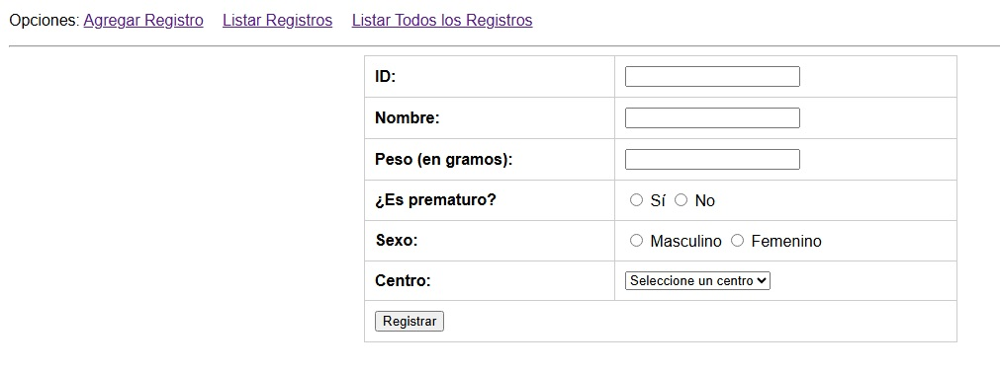
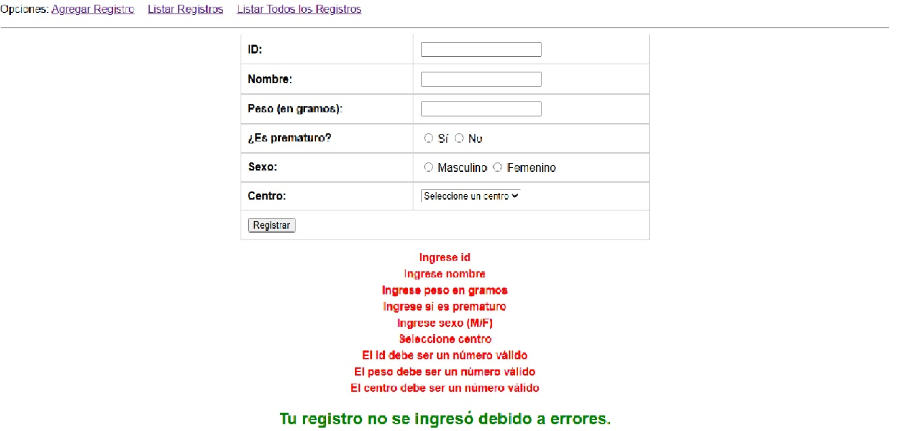
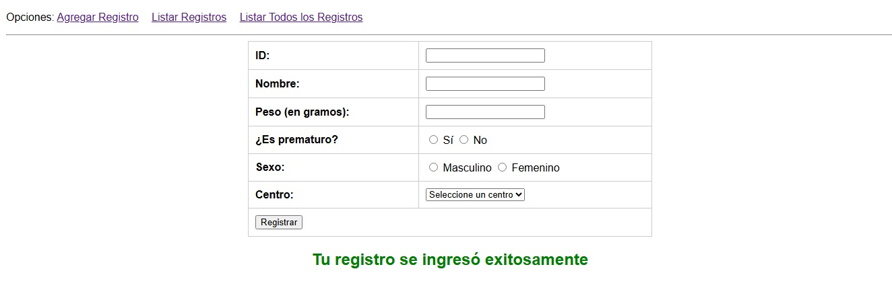
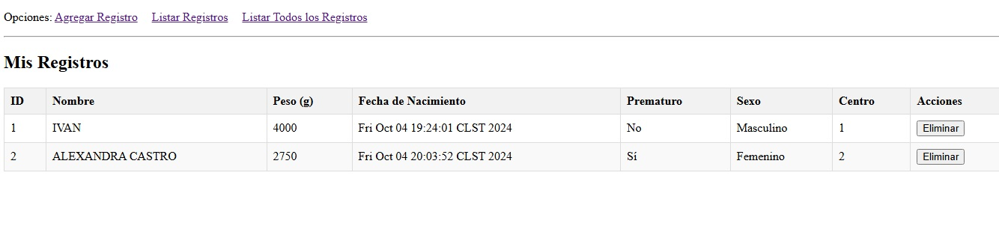

# Aplicación Web JEE - Registro de Nacimientos

## Descripción

Esta aplicación web en JEE permite registrar los nacimientos en diferentes centros asistenciales del país. Los usuarios pueden agregar información de los nacimientos, listar los registros existentes y eliminar un registro en caso de ser necesario.

El proyecto utiliza **JSP + Servlet**, el **patrón MVC**, y **JSTL + EL** para la gestión dinámica de las páginas JSP. Además, se utilizan colecciones para el almacenamiento de los datos.

## Tecnologías utilizadas

- Java EE (Servlet, JSP)
- Patrón MVC
- JSTL y Expresiones de Lenguaje (EL)
- Colecciones en Java
- GlassFish 5.0

## Funcionalidades

1. **Registro de nacimientos:** Permite ingresar los datos de los recién nacidos en centros asistenciales.
2. **Listado de nacimientos:** Muestra una lista con todos los registros almacenados.
3. **Eliminación de nacimientos:** Posibilidad de eliminar un registro por su ID, con un mensaje de confirmación de éxito.
4. **Validaciones de datos:** Verificación de los campos antes de registrar, con mensajes de error en caso de que haya datos incorrectos.

## Requerimientos

### Información a almacenar para cada nacimiento:

- **ID:** Número único identificador (int).
- **Nombre:** Nombre completo del bebé (String).
- **Peso:** Peso del bebé en gramos (int).
- **Fecha de Nacimiento:** Fecha actual (Date).
- **Prematuro:** Booleano que indica si el bebé es prematuro (boolean).
- **Sexo:** Género del bebé, 'M' para Masculino o 'F' para Femenino (char).
- **Centro Asistencial:** Centro de nacimiento (int).

### Reglas de negocio:

- Todos los campos son obligatorios.
- El **ID** y el **peso** deben ser números enteros.
- Si los datos ingresados no son válidos, se debe mostrar el mensaje: **"No se ha podido registrar el nacimiento"** junto con una lista de los errores.
- Si los datos son correctos, se muestra el mensaje: **"Se ha registrado el nacimiento correctamente"**.

### Validaciones:

- Todos los campos deben ser completados.
- El **ID** y el **peso** deben ser números.
  
### Navegación de páginas:

- **Página de inicio (Agregar):** Contiene el formulario para registrar los datos de un nacimiento.
- **Página de listar:** Muestra la lista de todos los nacimientos registrados con la opción de eliminar cada uno.
- Los enlaces de navegación están en un **JSP común** (opciones.jsp) que es incluido en todas las páginas.

## Estructura del Proyecto

1. **Controladores (Servlets):**
   - `RegistroServlet`: Maneja el registro de nacimientos.
   - `EliminarServlet`: Elimina un nacimiento por su ID.
   
2. **Vistas (JSP):**
   - `index.jsp`: Formulario para agregar nacimientos.
   - `listar.jsp`: Lista todos los nacimientos registrados y permite eliminarlos.
   - `opciones.jsp`: JSP común que contiene los enlaces de navegación.

## Capturas de Pantalla

### Página de Registro

### Validación de Registro

### Registro Exitoso

### Página de Listado

### Página de Eliminación

## Futuras Mejoras

- Conexión a una base de datos para almacenamiento persistente.
- Implementación de autenticación de usuarios para mayor seguridad.
- Mejora en la interfaz gráfica con frameworks como Bootstrap o Materialize.

## Licencia

Este proyecto está licenciado bajo la [MIT License](LICENSE).

